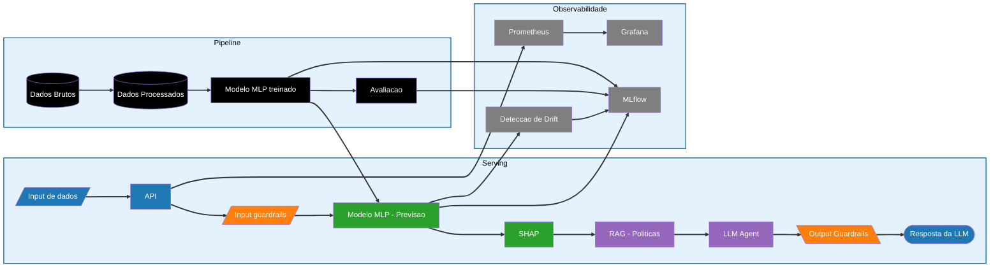

# 🧠 Credit Risk Analysis System — MLOps + LLMOps (datathon-grupo-03)

Projeto completo de Engenharia de Machine Learning que combina **modelo preditivo + LLM + RAG + governança**, cobrindo todo o ciclo de vida de um sistema de IA em produção.

## 🎯 Visão Geral

Este projeto implementa um sistema end-to-end de **análise de crédito com explicabilidade**, onde:

* Um modelo de ML prevê o risco de crédito
* Um agente LLM gera explicações em linguagem natural
* Guardrails garantem segurança e conformidade
* O sistema é monitorado, versionado e auditável

## 🧠 Arquitetura do Sistema

> O sistema combina um modelo preditivo com um agente LLM, garantindo explicabilidade, segurança e monitoramento contínuo.


---

## 🚀 Principais Diferenciais

### 🧠 ML + LLM integrados

* Modelo preditivo (PyTorch MLP)
* Agente ReAct com RAG
* Explicabilidade via SHAP

### 🛡️ Segurança e Governança

* Guardrails de input/output
* Red teaming com cenários adversariais
* Mapeamento OWASP
* Plano de conformidade com Lei Geral de Proteção de Dados

### 📊 Avaliação robusta

* RAGAS (4 métricas)
* LLM-as-judge
* Benchmark de configurações
* Golden dataset

### 📡 Observabilidade

* Monitoramento com Prometheus + Grafana
* Detecção de drift (PSI)
* Tracking com MLflow

### 🔁 Reprodutibilidade

* Pipeline com DVC
* CI/CD com GitHub Actions
* Versionamento completo de dados e modelo

---

## 🏗️ Estrutura do Projeto

```
datathon-grupo-03/
├── .github/workflows/       # CI/CD (GitHub Actions)
├── data/
│   ├── raw/                 # Dados brutos (via DVC)
│   ├── processed/           # Dados processados
|   ├── policies/            # Políticas de crédito para LLM
│   └── golden_set/          # Dataset de avaliação para LLM
├── src/
│   ├── features/            # Engenharia de features
│   ├── models/              # Treinamento e modelos
│   ├── agent/               # Agente + RAG
│   ├── serving/             # API (FastAPI)
│   ├── monitoring/          # Drift + métricas
│   └── security/            # Guardrails
├── tests/                   # Testes (pytest)
├── evaluation/              # Avaliação (RAGAS, LLM judge)
├── docs/                    # Documentação
├── notebooks/               # EDA
├── configs/                 # Configurações YAML
├── Makefile                 # Automação de comandos
├── pyproject.toml           # Dependências (uv)
├── dvc.yaml                 # Pipeline de dados
└── README.md
```
---

## 📚 Documentação

O projeto inclui documentação completa de governança e avaliação:

* Model Card
* System Card
* System Evaluation Report
* Guardrails Validation Report
* Red Team Report
* OWASP Mapping
* LGPD Plan

📂 Ver pasta: `docs/`


## 🧪 Exemplo de Uso

### Request

```json
{
    "borrower_income": 47300,
    "debt_to_income": 0.3657,
    "num_of_accounts": 3,
    "derogatory_marks": 0
}
```

### Output

> "Olá! Temos uma boa notícia: sua solicitação de crédito foi aprovada. Seu perfil demonstrou boa gestão financeira, com destaque para a ausência de registros negativos e um índice de comprometimento de renda dentro de parâmetros saudáveis. Em breve você receberá os detalhes do contrato."

## ⚙️ Stack Tecnológica

* ML: PyTorch
* LLM: Groq (llama-3.3-70b-versatile)
* API: FastAPI
* Tracking: MLflow
* Dados: DVC
* Monitoramento: Prometheus + Grafana
* Testes: pytest
* CI/CD: GitHub Actions

## 🚀 Setup Rápido

```bash
git clone https://github.com/Joaovmir/datathon-grupo-03
cd datathon-grupo-03
```
```
pip install uv
uv sync --group eda --group model --group serving --group monitoring --group data --group experiment --group agent
```

---

## 🔍 Pre-commit

Executa automaticamente antes de cada commit:

* Formatação (black)
* Imports (isort)
* Lint (flake8)
* Checks básicos

Rodar manualmente:

```bash
uv run pre-commit run --all-files
```

---

## 🧪 Testes

Rodar testes com cobertura:

```bash
uv run pytest --cov=src --cov-fail-under=60
```

Critério mínimo:

```
--cov-fail-under=60
```

## 🔁 Pipeline de Dados

```bash
dvc repro
```

## 📊 Monitoramento

* Prometheus → métricas
* Grafana → dashboards
* MLflow → experimentos

## 🐳 Docker

Requer que dvc repro tenha sido executado antes (artefatos precisam existir localmente).

```bash
docker-compose up --build
```

Acesso de cada container, conforme as portas:

- API: porta 8000
- MLFlow: porta 5000
- Prometheus: porta 9090
- Grafana: porta 3000

## 🌐 API

```bash
uv run uvicorn src.serving.app:app --reload --host 0.0.0.0 --port 8000
```

Docs:

```
http://localhost:8000/docs
```

## 📊 MLflow

Subir servidor local:

```bash
uv run mlflow server --host 0.0.0.0 --port 5000 --backend-store-uri sqlite:///mlflow.db --default-artifact-root /mlruns"
```

Acesse:

```
http://localhost:5000
```
---

## 🔒 Segurança

O sistema implementa:

* Validação rigorosa de inputs
* Filtro de linguagem proibida
* Testes adversariais (red team)
* Controle de comportamento do LLM

---

## 🚧 Status do Projeto

### Etapa 1 — Dados + Baseline

- [x] EDA documentada com insights relevantes
- [x] Baseline treinado e métricas reportadas no MLflow
- [x] Pipeline versionado (DVC + Docker) e reprodutível
- [x] Métricas de negócio mapeadas para métricas técnicas
- [x] pyproject.toml com todas as dependências

### Etapa 2 — LLM + Agente

- [x] LLM servido via API com quantização aplicada
- [x] Agente ReAct funcional com ≥ 3 tools relevantes ao domínio
- [x] RAG retornando contexto relevante dos dados fornecidos
- [x] CI/CD pipeline funcional (GitHub Actions)
- [x] Benchmark documentado com ≥ 3 configurações


### Etapa 3 — Avaliação + Observabilidade

- [x] Golden set com ≥ 20 pares relevantes ao domínio
- [x] RAGAS: 4 métricas calculadas e reportadas
- [x] LLM-as-judge com ≥ 3 critérios (incluindo critério de negócio)
- [~] Telemetria e dashboard funcionando end-to-end
- [x] Detecção de drift implementada e documentada


### Etapa 4 — Segurança + Governança

- [x] OWASP mapping com ≥ 5 ameaças e mitigações
- [x] Guardrails de input e output funcionais
- [x] ≥ 5 cenários adversariais testados e documentados
- [x] Plano LGPD aplicado ao caso real
- [x] Explicabilidade e fairness documentados
- [x] System Card completo

## 👥 Time

Datathon Grupo 03

* Igor do Nascimento Alves
* João Vitor de Miranda
* Mirla Borges Costa
